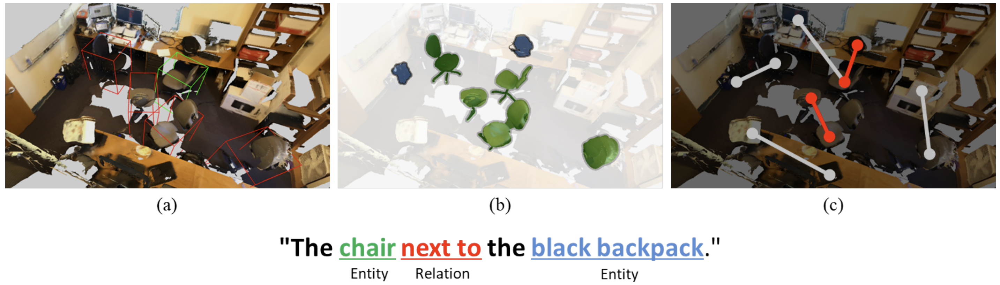
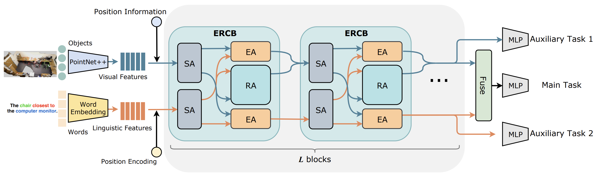

# TransRefer3D: Entity-and-Relation Aware Transformer for Fine-Grained 3D Visual Grounding 

TransRefer3D: Entity-and-Relation Aware Transformer for Fine-Grained 3D Visual Grounding [ACM MM'21] [[ArXiv](https://arxiv.org/abs/2108.02388)]

[Dailan He*](https://scholar.google.com/citations?user=f5MTTy4AAAAJ&hl=en&oi=ao), [Yusheng Zhao*](https://scholar.google.com/citations?hl=en&user=KDiTlFkAAAAJ), [Junyu Luo*](http://junyuluo.cn/), [Tianrui Hui](https://scholar.google.com/citations?hl=en&user=ArjkrTkAAAAJ), [Shaofei Huang](https://scholar.google.com/citations?hl=en&user=hVbSuo0AAAAJ), [Aixi Zhang](https://scholar.google.com/citations?hl=en&user=hNTP47EAAAAJ&view_op=list_works&sortby=pubdate) and [Si Liu†](http://colalab.org/).

🔥 Checkout our latest works in 3D Visual Grounding at [**3D-SPS**](https://github.com/fjhzhixi/3D-SPS).🔥

## Introduction

In this work, we exploit Transformer for its natural suitability on permutation-invariant 3D point clouds data and propose a TransRefer3D network to extract entity-and-relation aware multimodal context among objects for more discriminative feature learning. Concretely, we devise an Entity-aware Attention (EA) module and a Relation-aware Attention (RA) module to conduct fine-grained cross-modal feature matching. 



## Installation and Data Preparation

Please refer the installation and data preparation from [referit3d](https://github.com/referit3d/referit3d).

## Training
* To train on either Nr3d or Sr3d dataset, use the following commands
```bash
    python3 train_referit3d.py \
        --gpu 0 \
        --depth 4 \
        --experiment-tag $EXERPIMENT_TAG$ \
        --model transrefer3d \
        -scannet-file $PATH_OF_SCANNET_FILE$ \
        -referit3D-file $PATH_OF_REFERIT3D_FILE$ \
        --log-dir $LOG_DIR$ \
        --n-workers 4
```
feel free to change the number of workers to match your #CPUs and RAM size.

* To train nr3d in joint with sr3d, add the following argument
```bash
    --augment-with-sr3d sr3d_dataset_file.csv
``` 

## Evaluation
* To evaluate on either Nr3d or Sr3d dataset, use the following commands
```bash
python3 train_referit3d.py \
    --mode evaluate \
    --model transrefer3d \
    -scannet-file $PATH_OF_SCANNET_FILE$ \
    -referit3d-file $PATH_OF_REFERIT3D_FILE$ \
    --resume-path $PATH_OF_MODEL$ \
    --n-workers 4 
```
* To evaluate on joint trained model, add the following argument to the above command
```bash
    --augment-with-sr3d sr3d_dataset_file.csv
``` 

## Pretrained Models

On Nr3D: [[Google Drive](https://drive.google.com/file/d/14xh2EOElXSC-Sse2dVvYFkC8Vf5hynpb/view?usp=sharing)]  [[Baidu Pan](https://pan.baidu.com/s/1-H4WjD5OopHGhgShfEW4tw?pwd=7g9B)]

On Sr3D: [[Google Drive](https://drive.google.com/file/d/1csCtWdCfMvMtxB2Qh2qZDxaFDNC6B3qD/view?usp=sharing)]  [[Baidu Pan](https://pan.baidu.com/s/1qXoDN7PiyK8XIE8TCdCT2w?pwd=j0d7)]

Architecture of the proposed TransRefer3D. The blue arrows indicates the flow of visual features, while the red arrows showcases the flow of linguistic features.



## Citation

Please consider citing the corresponding publication if you find this work or code is helpful in your research,

```bibtex
@inproceedings{transrefer3d,
    title={TransRefer3D: Entity-and-Relation Aware Transformer for Fine-Grained 3D Visual Grounding},
    author={He, Dailan and Zhao, Yusheng and Luo, Junyu and Hui, Tianrui and Huang, Shaofei and Zhang, Aixi and Liu, Si},
    booktitle={Proceedings of the 29th ACM International Conference on Multimedia},
    year={2021}
}
```


## Credits

The project is built based on the following repository:

[ReferIt3D](https://github.com/referit3d/referit3d) 
